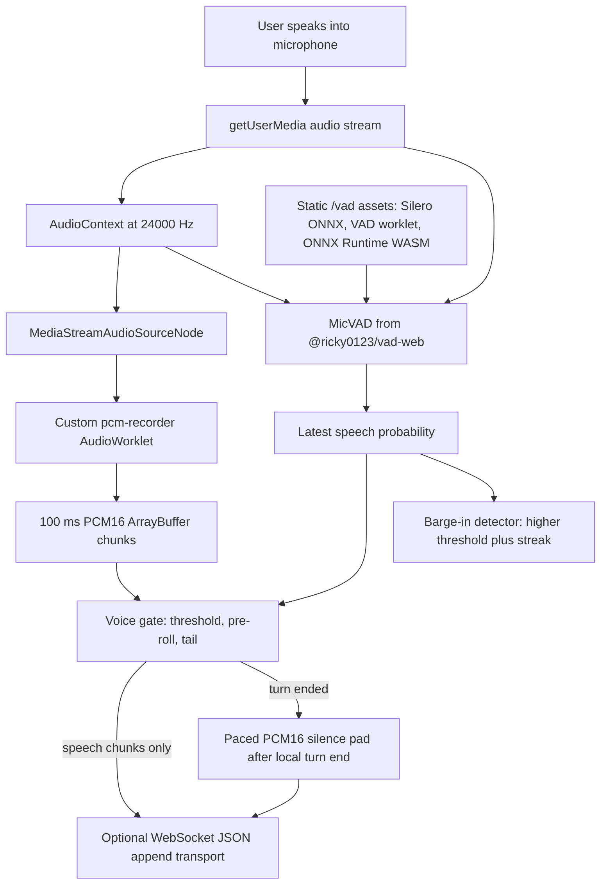
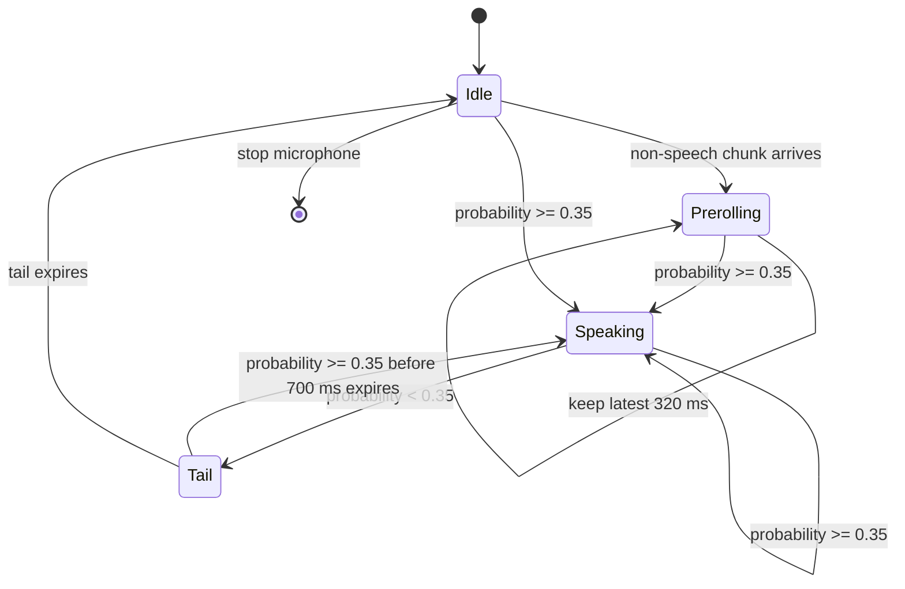
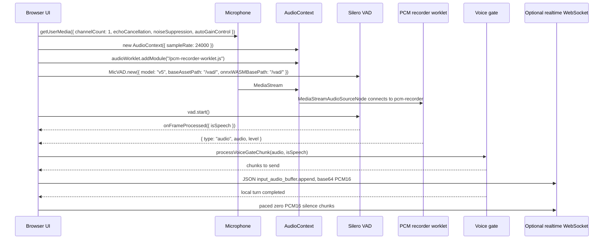

# Browser Silero VAD UI Pipeline

This repository documents a browser-only voice activity detection setup built around `@ricky0123/vad-web`, Silero VAD v5, Web Audio `AudioWorklet`, and 24 kHz mono PCM16 chunks.

The goal is to give an implementation agent enough exact detail to recreate the UI-side VAD architecture without needing access to any private application code. The setup is intentionally narrow: microphone capture, local VAD probability, pre-roll/tail gating, PCM chunking, optional WebSocket append transport, barge-in detection, runtime asset hosting, and validation.

## What This Setup Does

- Captures microphone audio through `navigator.mediaDevices.getUserMedia`.
- Creates a 24 kHz `AudioContext`.
- Loads a custom PCM recorder worklet from `/pcm-recorder-worklet.js`.
- Dynamically imports `@ricky0123/vad-web`.
- Starts `MicVAD` with `model: "v5"` and `processorType: "AudioWorklet"`.
- Serves the Silero model, VAD worklet, and ONNX Runtime WASM assets from `/vad/`.
- Tracks `probabilities.isSpeech` from `onFrameProcessed`.
- Uses that probability as the input to a deterministic voice gate.
- Emits 100 ms mono PCM16 chunks only while speech is active, including pre-roll and tail.
- Sends a paced 1.6 second PCM16 silence pad after local speech ends when an upstream VAD needs trailing real-time silence.
- Separately detects strong local speech for barge-in or interruption.
- Fails visibly if browser support or runtime assets are missing.

## High-Level Architecture



## Runtime Dependencies

Install these packages in the browser app:

```bash
npm install @ricky0123/vad-web onnxruntime-web
```

The setup this document mirrors used:

| Package | Version constraint | Purpose |
| --- | --- | --- |
| `@ricky0123/vad-web` | `^0.0.30` | Browser wrapper around Silero VAD, with `MicVAD`, model assets, and VAD worklet bundle. |
| `onnxruntime-web` | `^1.26.0` | WASM runtime used to execute the ONNX Silero model in the browser. |
| TypeScript | any modern 5.x version | Recommended for typed message contracts and VAD helpers. |

The app must run in a secure browser context. Use `https://`, `http://localhost`, or `http://127.0.0.1`; ordinary insecure HTTP origins cannot access the microphone.

## Browser Feature Requirements

The UI should check these capabilities before exposing or starting voice capture:

```ts
const supportsBrowserVad =
  typeof window !== "undefined" &&
  "AudioContext" in window &&
  "AudioWorkletNode" in window &&
  navigator.mediaDevices?.getUserMedia &&
  "WebSocket" in window &&
  "WebAssembly" in window;
```

Required capabilities:

| Capability | Why it matters |
| --- | --- |
| `getUserMedia` | Microphone stream acquisition. |
| `AudioContext` | Shared audio graph for capture and analysis. |
| `AudioWorkletNode` | Off-main-thread recorder and VAD processing. |
| `WebAssembly` | ONNX Runtime WASM backend. |
| Static file serving | `/vad/*` and `/pcm-recorder-worklet.js` must be reachable from the browser origin. |
| Optional `WebSocket` | Needed only if PCM chunks are streamed to a realtime backend. |

## Exact Configuration Values

These values are the important behavior of the setup.

| Name | Value | Meaning |
| --- | ---: | --- |
| `SAMPLE_RATE` | `24000` | Browser input context and outbound PCM sample rate. |
| `VOICE_RECORDER_CHUNK_MS` | `100` | Recorder emits roughly one PCM16 chunk every 100 ms. |
| `VOICE_PREROLL_MS` | `320` | Buffered audio sent before first positive speech frame. |
| `VOICE_TAIL_MS` | `700` | Extra audio sent after probability drops below threshold. |
| `VOICE_SERVER_VAD_SILENCE_PAD_MS` | `1600` | Optional trailing silence appended after local turn end. |
| `VOICE_VAD_POSITIVE_THRESHOLD` | `0.35` | Main local speech threshold from Silero probability. |
| `VOICE_VAD_NEGATIVE_THRESHOLD` | `0.2` | MicVAD hysteresis threshold. |
| `VOICE_BARGE_IN_THRESHOLD` | `0.68` | Stronger threshold for interruption/barge-in. |
| `VOICE_BARGE_IN_STREAK_MS` | `60` | Required consecutive speech duration before barge-in. |
| `VOICE_DEAD_SPOT_BUFFER_MS` | `60000` | Optional in-memory transport outage buffer. |
| `AUDIO_BACKPRESSURE_BYTES` | `524288` | Optional WebSocket send limit before buffering locally. |

The critical point is that local send/no-send decisions use Silero probability, not raw RMS. RMS is useful for a meter and diagnostics, but the gate should use `probabilities.isSpeech`.

## Static Assets

`@ricky0123/vad-web` does not work in production from the JavaScript import alone. The browser must be able to fetch all model and runtime assets from the same origin or an explicitly configured asset origin.

This setup serves assets from:

```text
/vad/
```

Expected files:

```text
public/vad/
  silero_vad_v5.onnx
  silero_vad_legacy.onnx
  vad.worklet.bundle.min.js
  ort-wasm-simd-threaded.mjs
  ort-wasm-simd-threaded.wasm
  ort-wasm-simd-threaded.asyncify.mjs
  ort-wasm-simd-threaded.asyncify.wasm
  ort-wasm-simd-threaded.jsep.mjs
  ort-wasm-simd-threaded.jsep.wasm
  ort-wasm-simd-threaded.jspi.mjs
  ort-wasm-simd-threaded.jspi.wasm
```

Copy them with:

```bash
npm run copy-vad-assets
```

The script in `scripts/copy-vad-assets.mjs` copies:

- `silero_vad_v5.onnx`, `silero_vad_legacy.onnx`, and `vad.worklet.bundle.min.js` from `node_modules/@ricky0123/vad-web/dist`.
- ONNX Runtime WASM and module files from `node_modules/onnxruntime-web/dist`.

Do not silently fall back to CDN assets in production unless that is a deliberate architecture choice. If local assets are missing, let voice startup fail visibly so deployment errors are obvious.

## Public File Layout

Use this public/static layout in a typical Next.js, Vite, Remix, or static web app:

```text
public/
  pcm-recorder-worklet.js
  vad/
    silero_vad_v5.onnx
    silero_vad_legacy.onnx
    vad.worklet.bundle.min.js
    ort-wasm-simd-threaded.mjs
    ort-wasm-simd-threaded.wasm
    ort-wasm-simd-threaded.asyncify.mjs
    ort-wasm-simd-threaded.asyncify.wasm
    ort-wasm-simd-threaded.jsep.mjs
    ort-wasm-simd-threaded.jsep.wasm
    ort-wasm-simd-threaded.jspi.mjs
    ort-wasm-simd-threaded.jspi.wasm
```

The example recorder worklet is in:

```text
examples/pcm-recorder-worklet.js
```

Copy it to:

```text
public/pcm-recorder-worklet.js
```

## Why There Are Two Worklets

This setup uses two separate worklet paths:

| Worklet | Owner | Job |
| --- | --- | --- |
| `vad.worklet.bundle.min.js` | `@ricky0123/vad-web` | Resamples incoming microphone frames to 16 kHz and feeds Silero VAD. |
| `pcm-recorder-worklet.js` | This app pattern | Emits outbound 24 kHz mono PCM16 chunks and lightweight RMS levels. |

Keeping these separate is simpler than trying to reuse the VAD worklet for transport audio. Silero wants its own model cadence and 16 kHz frames. The outbound realtime transport wants 24 kHz PCM16 chunks every 100 ms.

## Recorder Worklet Behavior

The recorder worklet:

1. Receives `Float32Array` audio frames from the browser audio graph.
2. Computes a simple RMS-like level for meters and diagnostics.
3. Buffers frames until it has `sampleRate * 0.1` samples.
4. Converts buffered float samples to signed 16-bit little-endian PCM.
5. Posts `{ type: "audio", audio: ArrayBuffer, level }` to the main thread.
6. Posts `{ type: "level", level }` during partial buffers so meters still update.

At `sampleRate = 24000`, each 100 ms chunk contains:

```text
24000 samples/sec * 0.100 sec = 2400 samples
2400 samples * 2 bytes PCM16 = 4800 bytes
```

Base64 JSON transport adds overhead. If transport pressure matters, watch `WebSocket.bufferedAmount`.

## Voice Gate State Machine



The gate returns chunks to send. It returns no chunks during pure silence. On the first speech chunk, it prepends buffered pre-roll so initial phonemes are not clipped.

Core algorithm lives in `examples/voice-activity.ts`.

## Start Microphone Flow

This is the generic wiring pattern:

```ts
import { MicVAD } from "@ricky0123/vad-web";
import {
  VOICE_PREROLL_MS,
  VOICE_TAIL_MS,
  VOICE_VAD_NEGATIVE_THRESHOLD,
  VOICE_VAD_POSITIVE_THRESHOLD,
  createVoiceGateState,
  processVoiceGateChunk,
} from "./voice-activity";

const SAMPLE_RATE = 24000;
const RECORDER_CHUNK_MS = 100;

type RecorderMessage =
  | { type: "audio"; audio: ArrayBuffer; level: number }
  | { type: "level"; level: number };

let latestVadProbability = 0;
const voiceGate = createVoiceGateState();

export async function startMicrophone(sendPcmChunk: (chunk: ArrayBuffer) => void) {
  const stream = await navigator.mediaDevices.getUserMedia({
    audio: {
      channelCount: 1,
      echoCancellation: true,
      noiseSuppression: true,
      autoGainControl: true,
    },
  });

  const audioContext = new AudioContext({ sampleRate: SAMPLE_RATE });
  await audioContext.resume();
  await audioContext.audioWorklet.addModule("/pcm-recorder-worklet.js");

  const vad = await MicVAD.new({
    startOnLoad: false,
    model: "v5",
    processorType: "AudioWorklet",
    baseAssetPath: "/vad/",
    onnxWASMBasePath: "/vad/",
    audioContext,
    getStream: async () => stream,
    pauseStream: async () => undefined,
    resumeStream: async () => stream,
    positiveSpeechThreshold: VOICE_VAD_POSITIVE_THRESHOLD,
    negativeSpeechThreshold: VOICE_VAD_NEGATIVE_THRESHOLD,
    redemptionMs: VOICE_TAIL_MS,
    preSpeechPadMs: VOICE_PREROLL_MS,
    minSpeechMs: 80,
    onFrameProcessed: (probabilities: { isSpeech: number }) => {
      latestVadProbability = probabilities.isSpeech;
    },
    onVADMisfire: () => {
      console.warn("vad_misfire", { vadProbability: latestVadProbability });
    },
    onSpeechStart: () => undefined,
    onSpeechRealStart: () => undefined,
    onSpeechEnd: () => undefined,
  });

  const source = audioContext.createMediaStreamSource(stream);
  const recorder = new AudioWorkletNode(audioContext, "pcm-recorder");
  source.connect(recorder);

  recorder.port.onmessage = (event: MessageEvent<RecorderMessage>) => {
    const message = event.data;
    if (message.type === "level") {
      updateMeter(message.level, latestVadProbability);
      return;
    }

    updateMeter(message.level, latestVadProbability);

    const decision = processVoiceGateChunk(
      voiceGate,
      message.audio,
      latestVadProbability,
      performance.now(),
      RECORDER_CHUNK_MS,
      {
        threshold: VOICE_VAD_POSITIVE_THRESHOLD,
        preRollMs: VOICE_PREROLL_MS,
        tailMs: VOICE_TAIL_MS,
      },
    );

    for (const chunk of decision.chunks) {
      sendPcmChunk(chunk);
    }
  };

  await vad.start();

  return {
    stream,
    audioContext,
    source,
    recorder,
    vad,
  };
}

function updateMeter(level: number, vadProbability: number) {
  // Render these however your UI wants.
  console.debug({ level, vadProbability });
}
```

## Stop Microphone Flow

Teardown order should be explicit. Destroy VAD, disconnect worklets, stop tracks, close the audio context, and reset the gate.

```ts
import { resetVoiceGateState } from "./voice-activity";

export async function stopMicrophone(resources: {
  vad?: { destroy: () => Promise<void> } | null;
  recorder?: AudioWorkletNode | null;
  source?: MediaStreamAudioSourceNode | null;
  stream?: MediaStream | null;
  audioContext?: AudioContext | null;
  voiceGate: ReturnType<typeof import("./voice-activity").createVoiceGateState>;
}) {
  await resources.vad?.destroy().catch(() => undefined);
  resources.recorder?.port.close();
  resources.recorder?.disconnect();
  resources.source?.disconnect();
  resources.stream?.getTracks().forEach((track) => track.stop());
  await resources.audioContext?.close().catch(() => undefined);
  resetVoiceGateState(resources.voiceGate);
}
```

## Optional JSON WebSocket Transport

The VAD setup itself is UI-only. If the app streams speech to a realtime endpoint, this is the transport shape used by the setup:

```json
{
  "type": "input_audio_buffer.append",
  "audio": "BASE64_PCM16_MONO_24KHZ"
}
```

The browser sends append-only audio messages. It does not need to send raw binary frames for this pattern.

ArrayBuffer to base64:

```ts
export function arrayBufferToBase64(buffer: ArrayBuffer) {
  const bytes = new Uint8Array(buffer);
  let binary = "";
  for (let offset = 0; offset < bytes.length; offset += 0x8000) {
    binary += String.fromCharCode(...bytes.subarray(offset, offset + 0x8000));
  }
  return btoa(binary);
}
```

Send helper:

```ts
const AUDIO_BACKPRESSURE_BYTES = 512 * 1024;

function sendAudioAppend(socket: WebSocket, chunk: ArrayBuffer) {
  if (socket.readyState !== WebSocket.OPEN) return false;
  if (socket.bufferedAmount > AUDIO_BACKPRESSURE_BYTES) return false;

  socket.send(
    JSON.stringify({
      type: "input_audio_buffer.append",
      audio: arrayBufferToBase64(chunk),
    }),
  );

  return true;
}
```

## Paced Silence Pad

Some upstream realtime VAD systems require trailing silence that arrives over wall-clock time. If local VAD stops sending immediately after speech, the upstream VAD can hear speech start but never observe enough silence to close the turn.

This setup appends 1.6 seconds of zero PCM16 after a local speech turn finishes. It sends that silence in 100 ms chunks, paced with `setTimeout`, instead of dumping the whole pad at once.

```ts
import {
  VOICE_RECORDER_CHUNK_MS,
  VOICE_SERVER_VAD_SILENCE_PAD_MS,
  createPcm16SilenceChunks,
} from "./voice-activity";

const SAMPLE_RATE = 24000;

export function sendPacedSilencePad(sendChunk: (chunk: ArrayBuffer) => boolean) {
  const chunks = createPcm16SilenceChunks(
    SAMPLE_RATE,
    VOICE_RECORDER_CHUNK_MS,
    VOICE_SERVER_VAD_SILENCE_PAD_MS,
  );

  let index = 0;

  const sendNext = () => {
    if (index >= chunks.length) return;
    const sent = sendChunk(chunks[index]);
    if (!sent) return;
    index += 1;
    if (index < chunks.length) {
      window.setTimeout(sendNext, VOICE_RECORDER_CHUNK_MS);
    }
  };

  sendNext();
}
```

When using an upstream VAD, the local browser VAD should decide what audio to forward, while the upstream VAD should own final turn closure. Avoid sending local client-side "commit" or "create response" events unless the upstream protocol explicitly requires the browser to own turn closure.

## Barge-In Detection

Do not use the same threshold for ordinary speech sending and interruption. This setup uses:

```text
ordinary send threshold: 0.35
barge-in threshold:      0.68
barge-in streak:         60 ms
```

Reasoning:

- `0.35` is sensitive enough to avoid clipping quiet speech when combined with pre-roll.
- `0.68` filters out tail noise, breaths, and many false positives during playback.
- `60 ms` requires at least one short streak of strong speech before interrupting.

Generic logic:

```ts
let bargeInStreakMs = 0;

function updateBargeIn(vadProbability: number, assistantCanBeInterrupted: boolean) {
  if (vadProbability >= 0.68) {
    bargeInStreakMs += 100;
  } else {
    bargeInStreakMs = 0;
  }

  if (bargeInStreakMs >= 60 && assistantCanBeInterrupted) {
    cutLocalPlayback();
    sendCancelToRealtimeEndpoint();
    return true;
  }

  return false;
}
```

Use the recorder cadence as the streak increment. In this setup that cadence is 100 ms, so one strong chunk can exceed the 60 ms threshold.

## Full UI State Flow



## Transport Outage Buffering

If using a WebSocket transport, handle the case where the mic is active but the socket is not ready. This setup buffers up to 60 seconds of gated speech in memory.

Recommended behavior:

1. If the socket is open, ready, and under backpressure limit, send live chunks.
2. If the socket is connecting or reconnecting, buffer gated chunks by local turn.
3. If a turn was already active before reconnection, merge its recovered beginning with the live tail after the socket opens.
4. If the buffer exceeds 60 seconds, stop capture or visibly report dropped speech.
5. Flush recovered audio only after the realtime endpoint confirms app-level readiness, not merely after raw WebSocket `open`.

Minimal queue shape:

```ts
type BufferedTurn = {
  id: string;
  capturedAt: number;
  chunks: ArrayBuffer[];
  durationMs: number;
};

const offlineSpeechQueue: BufferedTurn[] = [];
let offlineSpeechMs = 0;
```

## Asset Verification

Before validating voice UX, fetch these paths from the deployed origin:

```text
/pcm-recorder-worklet.js
/vad/silero_vad_v5.onnx
/vad/vad.worklet.bundle.min.js
/vad/ort-wasm-simd-threaded.wasm
/vad/ort-wasm-simd-threaded.mjs
/vad/ort-wasm-simd-threaded.asyncify.wasm
/vad/ort-wasm-simd-threaded.asyncify.mjs
/vad/ort-wasm-simd-threaded.jsep.wasm
/vad/ort-wasm-simd-threaded.jsep.mjs
/vad/ort-wasm-simd-threaded.jspi.wasm
/vad/ort-wasm-simd-threaded.jspi.mjs
```

Example check:

```bash
for path in \
  /pcm-recorder-worklet.js \
  /vad/silero_vad_v5.onnx \
  /vad/vad.worklet.bundle.min.js \
  /vad/ort-wasm-simd-threaded.wasm \
  /vad/ort-wasm-simd-threaded.mjs
do
  curl -I "https://YOUR_ORIGIN${path}"
done
```

Expected:

- HTTP `200`.
- Correct content length, not an HTML fallback page.
- No authentication redirect for VAD static assets.
- Cache headers are acceptable, but do not serve stale missing assets.

## Validation Checklist

Use this checklist before calling the setup complete:

- Browser prompts for microphone permission from a secure context.
- `AudioContext` starts or resumes after a user gesture when required.
- `/pcm-recorder-worklet.js` loads without a console error.
- `/vad/silero_vad_v5.onnx` loads from the configured `baseAssetPath`.
- ONNX Runtime WASM loads from the configured `onnxWASMBasePath`.
- `onFrameProcessed` fires repeatedly.
- `vadProbability` rises during speech and falls during silence.
- Recorder emits 100 ms PCM16 chunks.
- Silence does not produce outbound chunks beyond pre-roll maintenance.
- First speech chunk includes up to 320 ms of pre-roll.
- Brief pauses under 700 ms remain inside the same local turn.
- After local turn end, a 1.6 second silence pad is sent in 100 ms intervals if using upstream VAD.
- Strong speech above `0.68` for the configured streak triggers barge-in behavior when enabled.
- `WebSocket.bufferedAmount` backpressure is respected if streaming.
- Teardown destroys VAD, closes the recorder port, stops tracks, closes the audio context, and resets the gate.

## Debug Metrics To Expose

A compact voice debug panel should show:

| Metric | Source | Why |
| --- | --- | --- |
| VAD probability | `onFrameProcessed().isSpeech` | Primary speech detection signal. |
| RMS level | Recorder worklet `level` | Metering and input sanity check. |
| Voice gate state | `voiceGate.speaking` | Confirms local send/no-send state. |
| Outbound chunks | Send loop counter | Confirms audio is actually leaving the UI. |
| WebSocket buffered amount | `socket.bufferedAmount` | Backpressure and congestion signal. |
| Silence pad chunks | Silence pad sender | Confirms upstream VAD trailing silence behavior. |
| Dropped or buffered speech ms | Offline queue | Finds reconnect and readiness races. |
| First response/audio latency | App-specific timing | Finds turn closure and upstream VAD delays. |

## Common Failure Modes

| Symptom | Likely cause | Fix |
| --- | --- | --- |
| VAD import works locally but fails after deploy | `/vad` assets were not copied or deployed. | Run the asset copy script and verify deployed static paths. |
| Console shows ONNX Runtime fetch errors | `onnxWASMBasePath` points to the wrong directory. | Set `onnxWASMBasePath: "/vad/"` and serve ORT files there. |
| Voice starts but no probability updates | VAD worklet or model failed to load. | Check `/vad/vad.worklet.bundle.min.js` and `/vad/silero_vad_v5.onnx`. |
| Speech begins late or clips first syllable | No pre-roll or too little pre-roll. | Keep `preSpeechPadMs` and gate pre-roll around 320 ms. |
| Long delay before turn closes upstream | Upstream VAD needs more trailing silence. | Send paced zero PCM16 chunks for 1.6 seconds after local turn end. |
| False interruption during playback | Barge-in threshold too close to speech threshold. | Keep barge-in stricter, around `0.68`, and require a streak. |
| Mic reacquisition hangs on mobile reconnect | Capture is torn down and restarted from a timer without a fresh gesture. | Preserve mic and audio context through transient reconnects when possible. |
| WebSocket opens but early audio vanishes | App sends audio before protocol-level readiness. | Wait for a readiness event beyond raw socket `open`. |
| VAD appears too slow | Legacy model loaded instead of v5. | Set `model: "v5"` and verify `silero_vad_v5.onnx` is fetched. |

## Tuning Guide

Start with the exact values above, then tune one variable at a time.

For quiet speakers:

- Lower `VOICE_VAD_POSITIVE_THRESHOLD` slightly, for example `0.30`.
- Keep pre-roll at `320 ms` or higher.
- Do not lower barge-in at the same time.

For noisy rooms:

- Raise `VOICE_VAD_POSITIVE_THRESHOLD` toward `0.40`.
- Raise `VOICE_BARGE_IN_THRESHOLD` toward `0.75`.
- Consider disabling browser `autoGainControl` only after measuring whether it hurts or helps.

For faster turn-taking:

- Lower `VOICE_TAIL_MS` from `700` toward `500`.
- Keep the paced silence pad if an upstream VAD owns final closure.
- Measure from local speech end to first upstream response/audio, not just socket RTT.

For fewer clipped starts:

- Increase `VOICE_PREROLL_MS` from `320` to `400`.
- Keep chunk size at `100 ms` unless you are ready to retune transport and cadence assumptions.

## Framework Notes

### Next.js

- Put `pcm-recorder-worklet.js` at `public/pcm-recorder-worklet.js`.
- Put VAD assets under `public/vad`.
- Import `@ricky0123/vad-web` dynamically inside a client component or browser-only module.
- Do not import `MicVAD` in a Server Component.

### Vite

- Put files under `public/`.
- Use dynamic import from browser-only code.
- Verify the dev server serves `.onnx`, `.wasm`, `.mjs`, and `.js` as static assets.

### Static HTML

- Serve the page and assets from the same origin.
- Make sure the origin is secure enough for microphone access.
- Use a bundler or an ESM script capable of resolving `@ricky0123/vad-web`.

## Minimal Setup Steps For An AI Agent

1. Install dependencies:

   ```bash
   npm install @ricky0123/vad-web onnxruntime-web
   ```

2. Copy `examples/pcm-recorder-worklet.js` to `public/pcm-recorder-worklet.js`.

3. Copy VAD runtime assets:

   ```bash
   npm run copy-vad-assets
   ```

4. Add `examples/voice-activity.ts` to the app source tree.

5. In browser-only code, create:

   ```ts
   const stream = await navigator.mediaDevices.getUserMedia({ audio: { channelCount: 1 } });
   const audioContext = new AudioContext({ sampleRate: 24000 });
   await audioContext.audioWorklet.addModule("/pcm-recorder-worklet.js");
   ```

6. Create `MicVAD` with:

   ```ts
   const vad = await MicVAD.new({
     startOnLoad: false,
     model: "v5",
     processorType: "AudioWorklet",
     baseAssetPath: "/vad/",
     onnxWASMBasePath: "/vad/",
     audioContext,
     getStream: async () => stream,
     pauseStream: async () => undefined,
     resumeStream: async () => stream,
     positiveSpeechThreshold: 0.35,
     negativeSpeechThreshold: 0.2,
     redemptionMs: 700,
     preSpeechPadMs: 320,
     minSpeechMs: 80,
     onFrameProcessed: ({ isSpeech }) => {
       latestVadProbability = isSpeech;
     },
   });
   ```

7. Connect the recorder:

   ```ts
   const source = audioContext.createMediaStreamSource(stream);
   const recorder = new AudioWorkletNode(audioContext, "pcm-recorder");
   source.connect(recorder);
   ```

8. For each recorder audio message, call `processVoiceGateChunk` with the latest VAD probability.

9. Send only the chunks returned by the gate.

10. On local turn completion, send the paced silence pad if the upstream realtime system needs trailing silence.

11. On stop, destroy VAD, close the recorder port, disconnect source, stop tracks, close `AudioContext`, and reset the voice gate.

## Non-Goals

This repository does not document product behavior, authentication, personas, memory, image generation, backend business logic, or any app-specific feature. It only documents the browser VAD and audio capture/send pipeline.
